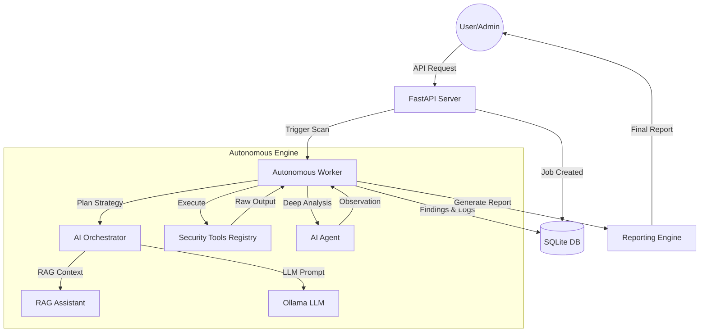

# Nexusuite v4 Architecture Map

## Overview
Nexusuite v4 adalah platform offensive security otonom yang menggabungkan berbagai security tools tradisional dengan kecerdasan buatan (AI) untuk melakukan penetrasi testing secara otomatis dan cerdas.

## System Architecture

### 1. Core Platform (Backend)
- **Framework**: FastAPI (Python 3.10+)
- **API Engine**: `nx_platform/v4/main.py`
- **Authentication**: RBAC berbasis API Key (`nx_platform/v4/core/auth.py`)
- **Storage**: SQLite (`platform_state.db`) dengan modul `nx_platform/v4/core/storage.py`
- **Configuration**: Manajemen environment dan registry tool (`nx_platform/v4/core/config.py`, `registry.py`)

### 2. Autonomous Engine (The Brain)
- **Orchestrator**: `nx_platform/v4/engine/orchestrator.py` - Mengelola strategi serangan menggunakan LLM (Ollama).
- **Worker**: `nx_platform/v4/engine/worker.py` - Mesin eksekusi utama yang menjalankan siklus hidup scan.
- **AI Agent**: `nx_platform/v4/ai_agent/` - Agen cerdas yang melakukan observasi, klasifikasi URL, analisis form, dan eksploitasi tingkat lanjut.
- **Tool Registry**: `nx_platform/v4/core/registry.py` - Katalog dinamis untuk perintah tool keamanan.

### 3. Workflow Scanning (Lifecycle)
Siklus hidup pemindaian otonom mengikuti alur:
1. **Reconnaissance (Phase 1 & 2)**: Discovery host/subdomain dan mapping infrastruktur.
2. **Intelligence Gathering (Phase 3)**: Crawling mendalam dan mining parameter.
3. **AI Observation (Phase 3.5)**: AI menganalisis target untuk menentukan vektor serangan terbaik.
4. **Vulnerability Research (Phase 4)**: Pemindaian kerentanan standar.
5. **Advanced Testing (Phase 4.5)**: Analisis form, deteksi CSRF/IDOR berbasis AI.
6. **Exploitation (Phase 5)**: Injeksi tertarget dan upaya eksploitasi.
7. **Reporting (Final)**: Konsolidasi temuan dan pembuatan laporan teknis/eksekutif.

### 4. External Integrations
- **Security Tools**: Nuclei, Sqlmap, Dalfox, Katana, Amass, Httpx, Nmap, Nikto, dll.
- **AI Engine**: Ollama (Deepseek, Llama, dll.) dengan integrasi RAG (Retrieval-Augmented Generation).

## Data Flow Diagram

## Business Process
1. **Inisialisasi**: Sistem memeriksa dependensi dan konfigurasi environment.
2. **Autentikasi**: Memvalidasi API Key untuk akses administratif atau user.
3. **Misi Scan**: User mengirimkan target URL. Sistem membuat Job ID dan menjalankan worker di background.
4. **Eksekusi Otonom**: Worker menjalankan workflow dari Recon hingga Exploit secara dinamis.
5. **Monitoring**: User dapat melihat progress, log, dan temuan secara real-time via API/Dashboard.
6. **Finalisasi**: Setelah scan selesai, sistem menghasilkan laporan komprehensif.
