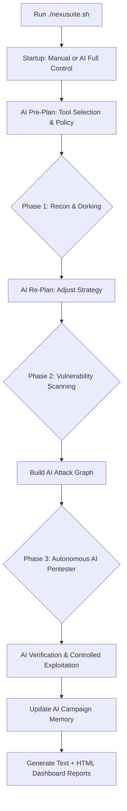

<h1 align="center">Nexusuite v3.5.0 (Autonomous AI Pentester Edition)</h1>

<p align="center">
  <b>Professional Web & Network Vulnerability Scanner with Autonomous AI Assistance</b><br>
  <i>Designed for Linux, Termux, and Windows (via WSL2).</i>
</p>

<p align="center">
  
  
  
  
</p>

---

## 🌟 What's New in v3.5.0 (AI Edition)
Nexusuite has evolved into a fully autonomous, AI-driven penetration testing framework. The AI doesn't just read outputs anymore; it actively plans, dorks, replans, and exploits.

- **🤖 AI Orchestrator (Full Control Mode):** The AI decision engine acts as the primary planner. It determines the optimal tool execution order, skips unnecessary tools, sets retry policies, and customizes arguments (`nmap`/`sqlmap`) per target.
- **🔍 Active AI Dorking & Discovery:** While tools run, the AI Orchestrator performs passive dorking (DuckDuckGo) in the background to find sensitive parameters, IDOR candidates, and exposed admin panels.
- **🧠 Multi-Phase AI Planning:** 
  1. **Pre-plan:** Initial tool selection and rate limiting.
  2. **Re-plan (Post-Recon):** AI adjusts its strategy (Web vs. Network focus) based on live recon data (alive hosts, URLs with params).
  3. **AI Attack Graph (Post-Vuln):** The AI builds a prioritized attack path based on confirmed vulnerabilities (`nuclei`, `sqlmap`, `xss`).
- **🧬 AI Campaign Memory:** The AI learns across targets. It remembers which CVEs/techniques worked or failed and applies this historical context to future targets.
- **🔥 Aggressive Mode:** Optional setting to increase verification depth, controlled exploitation actions, and dorking queries for deep testing.
- **📊 Enhanced HTML Dashboard:** Beautiful, interactive reporting including AI Decision Timelines, AI Attack Graphs, Dorking Intelligence, and Proxy Routing Audits.

---

## 📋 Overview
Nexusuite is a terminal-based security automation framework that combines industry-standard tools (`nmap`, `nuclei`, `ffuf`, `sqlmap`, `nikto`, and more) into a single guided workflow.

It includes powerful local AI support (Ollama + RAG) to:
- Act as an Autonomous Pentester (planning, verification, and controlled exploitation).
- Parse scan output and detect likely CVEs.
- Correlate with local exploit intelligence (`searchsploit` dataset).
- Provide practical next-step command suggestions for analysts.

## ✨ Key Features
- Interactive TUI powered by `gum` for a clean CLI experience.
- Recon and enumeration pipeline (`subfinder`, `httpx`, `gau`, `katana`, `paramspider`, `arjun`, `ffuf`).
- Vulnerability scanning orchestration (`nuclei`, `sqlmap`, `dalfox`, `wapiti`, `nikto`).
- **Proxy-aware execution** with per-tool proxy injection, routing policy controls, and safe local-bypass for AI/Ollama.
- Per-target proxy forensic audit (`attempt`, `exit_code`, `duration`, `cmd_hash`).
- Consolidated text report and comprehensive **HTML dashboard** generation.

---

## 🏗️ Workflow Architecture


---

## Requirements
Minimum required tooling includes:
- `gum`
- `subfinder`
- `httpx`
- `nmap`
- `nuclei`
- `dalfox`
- `gau`
- `katana`
- `arjun`
- `sqlmap`
- `paramspider`
- `nikto`
- `ffuf`
- `wafw00f`
- `jq`
- `python3`

## 🤖 AI Setup (Optional, Recommended)
```bash
# Install Ollama (Linux/macOS)
curl -fsSL https://ollama.com/install.sh | sh

# Pull a default local model
ollama pull qwen2.5:0.5b

# Install Python dependencies
pip install -r ai_rag_tool/requirements.txt
```

For Windows, install Ollama from [ollama.com/download](https://ollama.com/download).

Configure AI settings via `.env` (or export directly):
```bash
cp .env.example .env

# Base AI Config
OLLAMA_HOST=http://localhost:11434
OLLAMA_MODEL=qwen2.5:0.5b

# Advanced Autonomous Pentester Configs
AI_AGGRESSIVE_MODE=true
AI_AGGRESSIVE_LEVEL=2
AI_DORK_MAX_RESULTS=12
AI_PROXY_FOR_INTEL=false
AI_EXECUTE_VERIFICATION=true
AI_EXECUTE_CONTROLLED_ACTIONS=true
```

Optional exploit dataset update:
```bash
python3 ai_rag_tool/update_dataset.py
```

---

## Windows Support (WSL2 Recommended)
Nexusuite is best executed on Windows through WSL2 Ubuntu, since most security tools are Linux-native.

```powershell
# Run PowerShell as Administrator
wsl --install -d Ubuntu
```

After cloning the project:
```powershell
cd C:\AFUD\OWASP
powershell -ExecutionPolicy Bypass -File .\run_windows.ps1
```

Diagnostic examples:
```powershell
powershell -ExecutionPolicy Bypass -File .\run_windows.ps1 --doctor
powershell -ExecutionPolicy Bypass -File .\run_windows.ps1 --doctor-json
```

---

## 🚀 Usage
```bash
chmod +x nexusuite.sh
./nexusuite.sh
```

Interactive flow:
1. **Choose Startup Mode:** Select between `Manual` (AI for post-analysis only) or `AI Full Control` (Autonomous Pentester mode).
2. Configure proxy mode and routing policy:
   - `Best Effort`: falls back when strict proxy injection is unavailable.
   - `Strict Proxy-Only`: skips unsupported network steps to avoid direct leaks.
3. Provide target(s) (single host/domain, input file, or autonomous AI loading).
4. Select modules to execute (if not in Full Control).
5. Review generated reports and the HTML dashboard!

Additional CLI modes:
```bash
./nexusuite.sh --doctor
./nexusuite.sh --doctor-json
./nexusuite.sh --dry-run
./nexusuite.sh --platform-api
./nexusuite.sh --platform-worker
./nexusuite.sh --help
```

## 🏗️ Platform Mode (New)
Platform mode upgrades Nexusuite into a queue-driven service layer:
- Plugin-based tool runner via `config/tool_plugins/*.yaml`
- Persistent state with SQLite (`platform_state.db`)
- REST API for scans/jobs/findings
- Lightweight Web UI timeline (`http://127.0.0.1:8787/ui`)
- Unified finding schema with initial confidence + dedup merge
- Replay failed jobs from API without full rerun
- Policy-aware worker approval (tier low/medium/high)
- Approval Center di UI/API untuk approve job `awaiting_approval`
- Approval Center mendukung reject beralasan + bulk action

Quick start:
```bash
# Terminal 1
./nexusuite.sh --platform-api

# Terminal 2
./nexusuite.sh --platform-worker
```

## Scope Policy Precedence
Nexusuite supports policy-driven scope guard through `config/risk_policy.yaml` (or custom path via `AI_RISK_POLICY_FILE` in `.env`).

Scope evaluation order is:
1. `scope_blocklist` and `scope_blocked_suffixes` (highest priority, immediate block)
2. `scope_allowlist` (must match when defined)
3. Private/local range checks (`scope_allow_private_ranges`, `scope_allow_localhost`)

This means **blocklist always overrides allowlist**.

Example:
```yaml
scope_allow_private_ranges: false
scope_allow_localhost: false
scope_allowlist: example.com,api.example.com
scope_blocklist: admin.example.com,*.staging.example.com,*.internal
scope_blocked_suffixes: .internal,.corp,.lan,.local,home.arpa
```

With the above policy:
- `api.example.com` -> allowed
- `admin.example.com` -> blocked (explicit blocklist)
- `dev.staging.example.com` -> blocked (wildcard blocklist)
- `service.internal` -> blocked (suffix blocklist)

CLI mode details:
- `./nexusuite.sh --doctor`
  Runs a human-readable environment health check. Verifies required tools, Python module availability, and AI endpoint/model readiness (Ollama), then prints an operator-friendly status summary.
- `./nexusuite.sh --doctor-json`
  Runs the same health checks as `--doctor`, but outputs structured JSON for automation, CI/CD pipelines, or external monitoring/integration scripts.
- `./nexusuite.sh --dry-run`
  Simulates the full workflow without executing actual scan commands. Useful for validating configuration, module selection, target loading, and report flow safely before a real scan.
- `./nexusuite.sh --platform-api`
  Starts Nexusuite Platform API server and lightweight Web UI (`/ui`) for scan submission and monitoring.
- `./nexusuite.sh --platform-worker`
  Starts queue worker that continuously pulls pending jobs from SQLite state and executes plugin commands.
- `./nexusuite.sh --help`
  Displays command usage, available flags, and quick CLI references.

---

## Output Structure
Each scan session creates a timestamped output directory (for example: `OWASP_SCAN_YYYYMMDD_HHMMSS`).

Main output entry points:
- `README_OUTPUT.txt` (session-level navigation guide)
- `report/full_report.txt` (consolidated text report)
- `report/index.html` (dashboard report)
- `report/targets_navigator.txt` (quick target navigation)
- `report/file_map.csv` (machine-readable output map)

Per-target navigation and logs:
- `targets/<target>/README_TARGET.txt`
- `targets/<target>/scan.log`
- `targets/<target>/proxy_report.txt`

Proxy audit aggregation:
- `report/proxy_routing_summary.txt`
- Included in `report/full_report.txt` and `report/index.html`

---

## Repository Layout
```text
Nexusuite/
├── nexusuite.sh
├── run_windows.ps1
├── install.sh
├── modules/
└── ai_rag_tool/
    ├── autonomous_pentester.py
    ├── autonomous_pentester.sh
    ├── ai_config.py
    ├── ai_config.sh
    ├── rag_assistant.py
    ├── update_dataset.py
    └── requirements.txt
```

---

## Legal Notice
This project is intended for authorized security testing, bug bounty programs, and defensive research only.

Do not scan or exploit systems without explicit permission. Unauthorized access attempts are illegal. The authors and contributors are not responsible for misuse.
