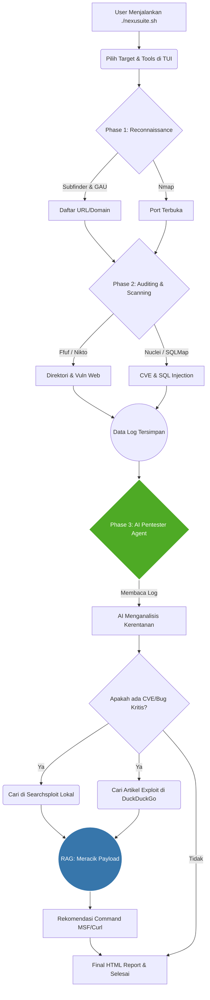

# Nexusuite
Next-Gen Autonomous Pentesting Suite. Scan targets with Nmap/Nuclei, and let the Local AI Agent analyze the logs to hunt for zero-days, search real-time exploits, and build weaponized payloads automatically.

<h1 align="center">
  🛡️ Nexusuite v3.3.0 (AI Edition)
</h1>

<p align="center">
  <b>Professional Web & Network Vulnerability Scanner with Autonomous AI Agent</b><br>
  <i>Built for Kali Linux, Termux, and Professional Pentesters.</i>
</p>

<p align="center">
  
  
  
  
</p>

---

## 📖 Tentang Tools Ini
**Nexusuite** adalah skrip automasi penetrasi keamanan berbasis antarmuka teks (TUI) yang menggabungkan alat-alat standar industri (Nmap, Nuclei, Ffuf, Sqlmap, Nikto) ke dalam satu alur kerja yang terstruktur dan mudah digunakan.

Kini hadir dengan **🤖 AI-Assisted Exploitation**, sebuah "Otak" AI lokal (berbasis Ollama & RAG) yang bertugas membaca hasil log scanning secara otomatis, menganalisis indikasi CVE, mencari database *exploit* lokal (via `searchsploit`), dan memberikan racikan perintah eksploitasi (*payload*) terbaru langsung ke terminal Anda!

## ✨ Fitur Unggulan
*   **Terminal User Interface (TUI) Elegan:** Dibangun dengan library `gum` sehingga memberikan pengalaman CLI modern, interaktif, dan penuh warna.
*   **Reconnaissance & Enum:** Pengumpulan subdomain (`subfinder`), URL (`gau`), port (`nmap`), dan parameter (`paramspider`).
*   **Vulnerability Scanning:** Pemindaian massal menggunakan `nuclei`, `sqlmap`, dan `nikto`.
*   **🤖 Autonomous AI Pentester:** Integrasi langsung dengan LLM lokal (Qwen/Llama3) untuk menganalisa *log*, menemukan eksploitasi dari internet (DuckDuckGo), dan memandu Anda untuk peretasan target (Human-in-the-Loop).
*   **Laporan HTML Dinamis:** Semua hasil temuan akan di-generate ke dalam satu *dashboard* laporan HTML yang elegan.

---

## ⚙️ Arsitektur & Alur Kerja (Workflow)

Di bawah ini adalah diagram arsitektur yang menjelaskan bagaimana skrip Bash dan Agen AI Python bekerja sama secara *real-time*.



---

## 🚀 Instalasi & Persiapan

### 1. Kebutuhan Dasar (Dependencies)
Tools ini membutuhkan beberapa program standar *hacking* terinstal di sistem Anda (Kali Linux/Parrot OS/Termux). 
*   `gum`, `nmap`, `subfinder`, `nuclei`, `sqlmap`, `ffuf`, `nikto`, `python3`

### 2. Instalasi AI Agent (Opsional tapi Direkomendasikan)
Agar fitur "Otak AI" berjalan, Anda memerlukan LLM lokal dan *library* Python.

```bash
# 1. Install Ollama
curl -fsSL https://ollama.com/install.sh | sh

# 2. Unduh Model AI yang Ringan (Qwen2.5:0.5b atau Llama3)
ollama run qwen2.5:0.5b

# 3. Install Library Python untuk RAG (Internet Search)
pip install requests duckduckgo-search
```
*(Catatan: Untuk pengguna Termux, Ollama sebaiknya dijalankan di Laptop yang berada di satu jaringan WiFi, lalu ubah URL `localhost` di file `ai_rag_tool/autonomous_pentester.py` menjadi IP Laptop).*

### 3. Mengunduh Database Exploit Asli (Penting!)
Agar AI Anda memiliki "perpustakaan hacking" sungguhan, jalankan skrip *updater* ini sekali saja:
```bash
python3 ai_rag_tool/update_dataset.py
```
*(Ini akan mengunduh dataset asli Exploit-DB ke folder lokal).*

---

## 💻 Cara Penggunaan

Cukup jalankan *script* utamanya, dan ikuti panduan interaktif di layar terminal:

```bash
chmod +x nexusuite.sh
./nexusuite.sh targets.txt
```

**Langkah-langkah di layar:**
1. Anda akan ditanya apakah ingin **menggunakan AI Pentester** (Ketik `y` atau `n`).
2. Tentukan target URL/IP (bisa satu atau dari file `.txt`).
3. Centang modul apa saja yang ingin dijalankan (Gunakan `Spasi` untuk memilih, `Enter` untuk lanjut).
4. Duduk dan tunggu. Setelah Nmap dan tools lainnya selesai, AI akan mengambil alih, mencari *exploit* di *searchsploit* & internet, dan memberikan Anda perintah eksploitasi siap pakai!

---

## 📁 Struktur Direktori

```text
Nexusuite/
├── nexusuite.sh              # Skrip Eksekusi Utama
├── install.sh                # Skrip instalasi dependensi (Go, APT, dsb)
├── modules/                  # Kumpulan sub-script Bash (UI, Core, Reporting)
└── ai_rag_tool/              # Folder Otak AI Python
    ├── autonomous_pentester.py  # Agen AI Utama (Error Handling & Web Search)
    ├── rag_assistant.py         # Skrip Vector/Pencocokan Lokal
    ├── update_dataset.py        # Pengunduh Exploit-DB Resmi
    └── exploit_db_real.json     # (Dibuat otomatis) Database kerentanan offline
```

---

## ⚠️ Disclaimer
**Dibuat untuk tujuan Edukasi dan Profesional (Bug Bounty & Pentesting Legal).** Segala tindakan eksploitasi terhadap sistem yang tidak Anda miliki izinnya adalah **ilegal**. Pengembang tidak bertanggung jawab atas penyalahgunaan alat ini.
