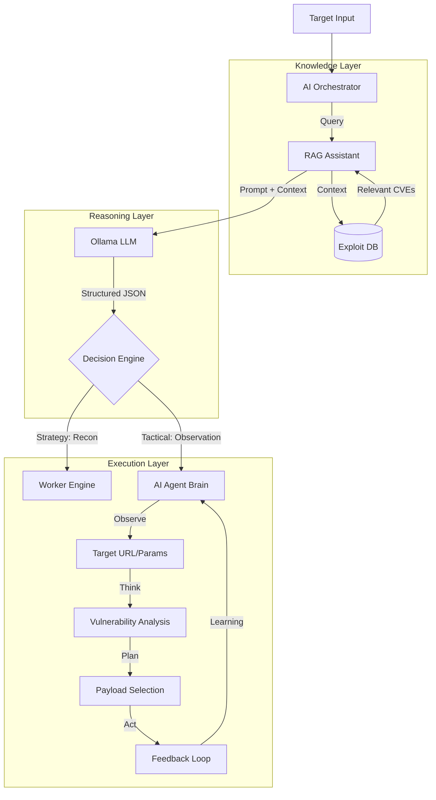
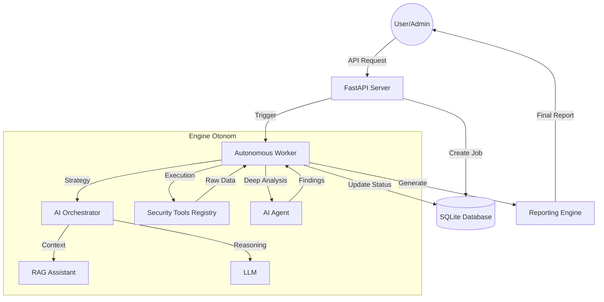

<p align="center">
  
</p>

<h1 align="center">Nexusuite v4.1.0</h1>

<p align="center">
  <b>Advanced AI-First Autonomous Offensive Security Platform</b><br>
  <i>Empowering security teams with automated precision, deep AI reasoning, and a high-performance scanning engine.</i>
</p>

<p align="center">
  <a href="https://github.com/your-username/nexusuite/releases"></a>
  <a href="https://python.org"></a>
  <a href="https://fastapi.tiangolo.com"></a>
  <a href="https://ollama.com"></a>
  <a href="https://opensource.org/licenses/MIT"></a>
</p>

---

## 📖 Deskripsi Proyek

**Nexusuite v4.1.0** adalah platform *offensive security* otonom generasi terbaru yang dirancang untuk mengotomatisasi seluruh siklus hidup pengujian penetrasi (pentesting). Berbeda dengan scanner tradisional, Nexusuite mengintegrasikan **Kecerdasan Buatan (AI)** di setiap fasenya—mulai dari perencanaan strategi serangan hingga verifikasi kerentanan yang kompleks.

Dibangun dengan arsitektur **asinkron berbasis FastAPI**, Nexusuite menawarkan kecepatan eksekusi yang luar biasa, manajemen pekerjaan yang persisten dengan SQLite, dan antarmuka dashboard modern untuk pemantauan real-time.

---

## ✨ Fitur Utama

- **🤖 Autonomous AI Agent (The Brain):** Menggunakan LLM (Ollama) dan RAG untuk melakukan observasi target, klasifikasi URL cerdas, dan pengambilan keputusan otonom.
- **⚡ High-Performance Async Engine:** Eksekusi tool keamanan secara paralel dan non-blocking untuk efisiensi maksimal.
- **🔍 8-Phase Scanning Lifecycle:** Alur kerja komprehensif dari Reconnaissance, Intelligence Gathering, AI Observation, hingga Exploitation dan Reporting.
- **🛠 Self-Healing Bootstrap:** Sistem cerdas yang secara otomatis mendeteksi, menginstal, dan memperbaiki dependensi sistem serta tool keamanan yang hilang.
- **📊 Real-time Web Dashboard:** Antarmuka visual yang menyajikan timeline aktivitas AI, grafik serangan (Attack Graph), dan laporan teknis mendalam.
- **🔐 Enterprise-Grade Security:** Sistem autentikasi berbasis API Key (RBAC) dan manajemen risiko (Risk Policy) untuk mengontrol ruang lingkup pemindaian.
- **🔌 Dynamic Tool Registry:** Katalog perintah tool yang dapat diperluas melalui file konfigurasi YAML, memungkinkan integrasi tool baru dengan mudah.

---

## 🚀 Evolusi Mesin: v3 vs v4

Engine v4 bukan sekadar pembaruan kecil, melainkan perombakan total dari fundamental sistem untuk mendukung operasi otonom skala besar.

| Fitur | Nexusuite v3 (Legacy) | Nexusuite v4 (Next-Gen) |
| :--- | :--- | :--- |
| **Arsitektur Utama** | Shell-script driven (Sequential) | Python Async API-driven (FastAPI) |
| **Peran AI** | Analisis hasil scan setelah selesai | Perencanaan strategi otonom & observasi real-time |
| **Eksekusi Tool** | Satu per satu (Blocking) | Paralel & Background Tasks (Non-blocking) |
| **Integrasi AI** | Prompt dasar ke Ollama | Terintegrasi RAG dengan basis pengetahuan lokal |
| **Manajemen Data** | File teks & JSON terpisah | Database terpusat SQLite dengan migrasi otomatis |
| **Antarmuka** | TUI (Terminal User Interface) | Dashboard Web Modern + CLI Cerdas |
| **Analisis Web** | Crawling standar | AI-based Form Analysis (CSRF/IDOR detection) |
| **Reliabilitas** | Manual install dependensi | Self-healing Bootstrap (Auto-install tools) |

---

## 🧠 Mekanisme AI & LLM Orchestration (Deep Dive)

Nexusuite v4 mengimplementasikan arsitektur **Cognitive Offensive AI** yang membagi kecerdasan buatan ke dalam dua lapisan utama: **Global Strategist (Orchestrator)** dan **Tactical Agent (AI Brain)**.

### **1. AI Architecture Framework**
Sistem ini menggunakan siklus kognitif asinkron yang terintegrasi dengan **Ollama** sebagai LLM backend dan **RAG (Retrieval-Augmented Generation)** untuk injeksi pengetahuan exploit lokal.


```mermaid
graph TD
    A[Target Input] --> B[AI Orchestrator]
    
    subgraph "Knowledge Layer"
        B -->|Query| C[RAG Assistant]
        C -->|Context| D[(Exploit DB)]
        D -->|Relevant CVEs| C
    end
    
    subgraph "Reasoning Layer"
        C -->|Prompt + Context| E[Ollama LLM]
        E -->|Structured JSON| F{Decision Engine}
    end
    
    subgraph "Execution Layer"
        F -->|Strategy: Recon| G[Worker Engine]
        F -->|Tactical: Observation| H[AI Agent Brain]
        H -->|Observe| I[Target URL/Params]
        I -->|Think| J[Vulnerability Analysis]
        J -->|Plan| K[Payload Selection]
        K -->|Act| L[Feedback Loop]
    end
    
    L -->|Learning| H
```

### **2. Cara Kerja AI Agent (The Brain)**
Agen taktis beroperasi menggunakan metodologi **Chain-of-Thought (CoT)** untuk memproses data mentah menjadi langkah eksploitasi yang divalidasi:

*   **OBSERVE**: Menganalisis ribuan URL hasil crawling menggunakan regex dan LLM untuk mengidentifikasi "Interesting Paths" (e.g., `/admin`, `/api/v1/user/delete`).
*   **THINK**: Melakukan penalaran deduktif terhadap tumpukan teknologi (Tech Stack) yang terdeteksi. AI mempertimbangkan: *"Jika server menggunakan PHP 7.4 dan terdapat parameter 'file', apakah LFI lebih mungkin daripada SQLi?"*
*   **ACT (Feedback Loop)**: AI mencoba payload dari `SmartPayloadGenerator` dan menganalisis respons HTTP. Jika gagal (e.g., WAF blocking), AI akan "belajar" dan menyesuaikan strategi (misal: beralih ke teknik *encoding bypass*).

### **3. RAG (Retrieval-Augmented Generation)**
Tidak seperti LLM standar yang hanya mengandalkan *pre-trained data*, Nexusuite v4 menyuntikkan data spesifik dari `exploit_db.json` ke dalam prompt secara dinamis:
1.  **Similarity Search**: Mencari kerentanan serupa berdasarkan fingerprint target.
2.  **Context Injection**: Menambahkan instruksi spesifik tentang cara mengeksploitasi CVE tertentu langsung ke dalam instruksi LLM.
3.  **Precision Prompting**: Menggunakan *low temperature* (0.3) untuk memastikan output JSON yang konsisten dan dapat diproses oleh mesin.

---

## 🏗️ Arsitektur & Cara Kerja

Nexusuite beroperasi sebagai ekosistem otonom yang membagi beban kerja ke dalam beberapa modul utama:

### **Alur Data (Workflow)**

```mermaid
graph TD
    User((User/Admin)) -->|API Request| API[FastAPI Server]
    API -->|Create Job| DB[(SQLite Database)]
    API -->|Trigger| Worker[Autonomous Worker]
    
    subgraph "Engine Otonom"
        Worker -->|Strategy| Orchestrator[AI Orchestrator]
        Orchestrator -->|Context| RAG[RAG Assistant]
        Orchestrator -->|Reasoning| Ollama[LLM]
        
        Worker -->|Execution| Tools[Security Tools Registry]
        Tools -->|Raw Data| Worker
        
        Worker -->|Deep Analysis| AIAgent[AI Agent]
        AIAgent -->|Findings| Worker
    end
    
    Worker -->|Update Status| DB
    Worker -->|Generate| Report[Reporting Engine]
    Report -->|Final Report| User
```

### **8-Phase Lifecycle**
1.  **Reconnaissance (Passive/Active)**: Memetakan permukaan serangan dan host yang aktif.
2.  **Infrastructure Mapping**: Fingerprinting WAF, teknologi web, dan pemindaian port.
3.  **Intelligence Gathering**: Crawling mendalam dan ekstraksi parameter menggunakan AI.
4.  **AI Observation**: Analisis cerdas terhadap target untuk menentukan prioritas serangan.
5.  **Vulnerability Research**: Pemindaian kerentanan otomatis menggunakan scanner standar industri.
6.  **Advanced AI Testing**: Deteksi kerentanan logika (CSRF/IDOR) melalui analisis form cerdas.
7.  **Exploitation**: Upaya eksploitasi terfokus pada target yang telah divalidasi.
8.  **Final Reporting**: Konsolidasi seluruh temuan ke dalam laporan teknis dan eksekutif.

---

## 🚀 Panduan Instalasi

### **Prasyarat Sistem**
- **OS:** Ubuntu 22.04+ (Direkomendasikan), WSL2, atau Kali Linux.
- **Python:** v3.10 atau lebih tinggi.
- **Go:** v1.21+ (untuk tool ProjectDiscovery).
- **AI:** [Ollama](https://ollama.com/) terinstal untuk fitur otonom AI.

### **Langkah Instalasi**

1. **Clone Repositori:**
   ```bash
   git clone https://github.com/your-username/nexusuite.git
   cd nexusuite
   ```

2. **Instalasi Tool Sistem:**
   Jalankan script installer untuk mengotomatisasi instalasi tool seperti Nuclei, Sqlmap, dll.
   ```bash
   chmod +x install.sh
   ./install.sh
   ```

3. **Bootstrap Dependensi Python:**
   Sistem akan secara otomatis menyiapkan virtual environment dan dependensi yang diperlukan.
   ```bash
   python nx_platform/v4/core/bootstrap.py
   ```

4. **Konfigurasi Environment:**
   Salin file contoh `.env` dan sesuaikan kunci API serta pengaturan AI Anda.
   ```bash
   cp .env.example .env
   # Edit .env dengan editor favorit Anda
   ```

---

## 💡 Cara Penggunaan

### **Mode Platform (Dashboard)**
Rekomendasi penggunaan untuk pemantauan visual dan manajemen banyak pekerjaan sekaligus.

```bash
# Jalankan server utama
python nx_platform/v4/main.py
```
Akses UI di: **`http://localhost:8000`**

### **Mode CLI (Otonom)**
Gunakan untuk pemindaian cepat langsung dari terminal.

```bash
python nx_platform/v4/core/cli.py --target https://example.com --ai-mode hybrid
```

---

## 📂 Struktur Direktori

```text
Nexusuite/
├── nx_platform/v4/         # Core Engine & API
│   ├── ai_agent/           # Logika AI Agent & Payload Gen
│   ├── api/                # FastAPI Routes & Models
│   ├── core/               # Bootstrap, Registry, Auth, Storage
│   ├── engine/             # Orchestrator & Worker Logic
│   └── static/             # Dashboard Assets (JS/CSS)
├── config/                 # Tool Plugins & Risk Policies
├── results/                # Output pemindaian & laporan
├── ai_rag_tool/            # Modul RAG & Dataset Exploit
├── nexusuite.sh            # Entry point legacy (Shell)
└── platform_state.db       # Database SQLite (Auto-generated)
```

---

## 🛠 Troubleshooting

| Masalah | Solusi |
| :--- | :--- |
| `ModuleNotFoundError` | Jalankan kembali `python nx_platform/v4/core/bootstrap.py` untuk memastikan semua library terinstal. |
| AI Agent Gagal (Ollama) | Pastikan server Ollama berjalan (`ollama serve`) dan model yang dikonfigurasi di `.env` sudah di-pull. |
| Tool tidak ditemukan | Cek PATH Anda atau jalankan `./install.sh` kembali. |
| Error Database | Hapus `platform_state.db` (Hati-hati: data lama akan hilang) dan jalankan aplikasi kembali untuk inisialisasi ulang. |

---

## 🤝 Kontribusi & Lisensi

Kami sangat menghargai kontribusi dari komunitas! Silakan buka *Issue* atau kirimkan *Pull Request* untuk perbaikan bug atau fitur baru.

**Nexusuite** didistribusikan di bawah **[Lisensi MIT](LICENSE)**.

---

## ⚖️ Legal Notice

> **Peringatan:** Nexusuite dibuat hanya untuk tujuan pendidikan dan pengujian keamanan yang sah. Penggunaan alat ini untuk menyerang target tanpa izin tertulis adalah ilegal dan tidak etis. Penulis tidak bertanggung jawab atas penyalahgunaan atau kerusakan yang disebabkan oleh alat ini.

---
<p align="center">Made with ❤️ for the Security Community</p>
